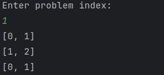

# myLeetCode

#### 仓库介绍
个人力扣刷题记录
[瞌睡菇@Leetcode](https://leetcode.cn/u/keshuigu/)

#### 仓库结构

- problem: 已完成的题目，以难度区分
  - Easy
  - Medium
  - Hard
- solution: 已完成的题目的解，以题目序号区分
- testcase：用于解题过程中debug
  - test_any.py: 通用测试入口
  - testcase.py: 使用题目描述中的参考用例，对题解函数进行测试
- main.py: 调用test_any测试题解
- test.py: 调用testcase使用题目描述中的参考用例，对题解函数进行测试

#### 使用说明

1.  使用main.py 

    修改代码中的index为题目序号,args为测试所需的输入进行测试
    
    ```python
    # index 测试的题目序号
    # args 输入的参数
    # 下面语句测试题目1,输入的参数为[2,7,11,15], 9
    # 输出为[0, 1]
    print(test_any(index="1", args=[[2, 7, 11, 15], 9]))
    ```

2.  使用test.py 

    shell交互,输入题目序号,自动使用题目给出的测试用例进行测试

    