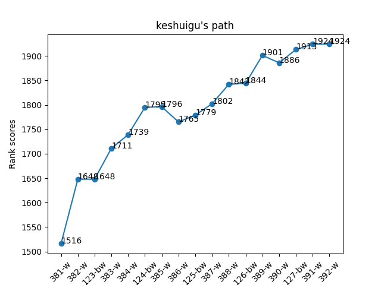
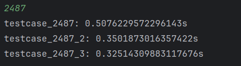

# myLeetCode

#### 仓库介绍

个人力扣刷题记录
[瞌睡菇@Leetcode](https://leetcode.cn/u/keshuigu/)



#### 仓库结构

- `problem`: 已完成的题目，以难度区分
    - [Easy.md](./problem/Easy.md)
    - [Medium.md](./problem/Medium.md)
    - [Hard.md](./problem/Hard.md)
- `solution`: 已完成的题目的解，以题目序号区分
- `testcase`：用于解题过程中debug
    - `test_any.py`: 通用测试入口
    - `testcase.py`: 使用题目描述中的参考用例，对题解函数进行测试
- `main.py`: 调用`test_any`测试题解
- `test.py`: 调用`testcase`使用题目描述中的参考用例，对题解函数进行测试
- `test.py`: 调用`testcase`使用题目描述中的参考用例，对所有的题解函数进行用时统计

#### 使用说明

1. 使用`main.py`

   修改代码中的index为题目序号,args为测试所需的输入进行测试

   ```python
   # index 测试的题目序号
   # args 输入的参数
   # 下面语句测试题目1,输入的参数为[2,7,11,15], 9
   # 输出为[0, 1]
   print(test_any(index="1", args=[[2, 7, 11, 15], 9]))
   ```

2. 使用`test.py`

   `shell`交互,输入题目序号,自动使用题目给出的测试用例进行测试
   

3. 使用`test_time.py`: 图一乐,小数据情况下意义不大

   `shell`交互,输入题目序号,自动使用题目给出的测试用例进行时间测试
   